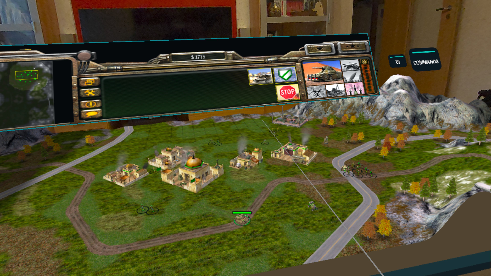
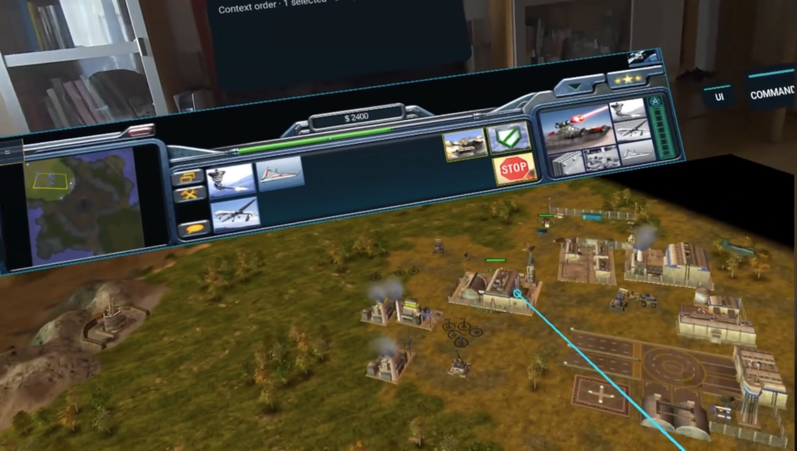
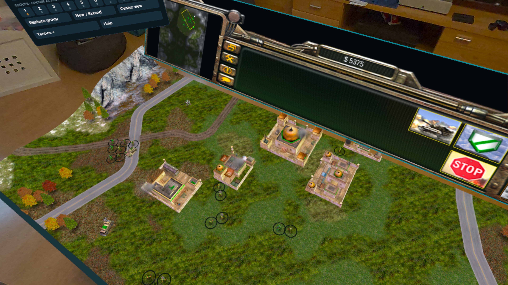
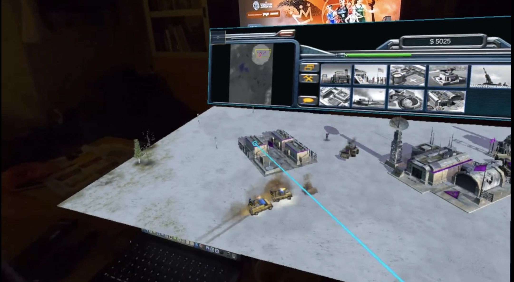

# Generals: Zero Hour XR

An unofficial Meta Quest 3 tabletop port of *Command & Conquer: Generals – Zero Hour*. The original game's terrain, units and effects appear as a stereoscopic miniature battlefield, with separate spatial build, command and settings windows. This is a community project, not an Electronic Arts product or endorsement.



<p align="center">
  
  
</p>

<p align="center">
  
</p>

These are headset captures supplied by the project maintainer. Map, faction, graphics settings and room lighting vary; the images illustrate the tabletop presentation rather than certify a particular APK build.

## What works in the Quest preview

- Native OpenXR stereo tabletop gameplay using the original Zero Hour game world, not replacement models.
- Campaign and offline AI Skirmish in the tabletop presentation; cinematics and full native dialogs appear upright.
- Touch-controller selection, drag-box multi-selection, contextual orders, map pan/rotate/zoom, radar navigation, building rotation, groups and waypoint routes.
- Detached build window, persistent Commands window and a spatial UI panel; move, tilt, scale or recenter the workspace. Optional detected-surface or manual-height placement does not require a room scan.
- Matching UI, Commands and Ground View shortcuts beside the board. During live offline Campaign and Skirmish gameplay, Ground View offers an optional human-scale, passive view of visible terrain; controller walking and turning are experimental, with B/Y returning to the unchanged tabletop. Videos and scripted camera sequences use the regular presentation.
- English and German XR interface/help, left-handed controller mode, hover names and build costs.
- Meta's native Quest keyboard for original game text fields, including LAN player name, chat and Direct Connect address entry. This improves text entry but does not make human multiplayer release-ready.
- An XR Victory/Defeat/Match over card remains visible across the transition to match statistics.
- Quest 3 defaults: Balanced resolution, Light shadows and Multiview. Higher quality modes, including Ultra+, are optional and may cost performance.

The **supported preview path is offline play**. Human LAN/Internet multiplayer, replay XR, keyboard/mouse input and persistent room anchors are **not release-ready**. Direct Connect can start an experimental LAN match, but Quest–PC games currently fail simulation synchronization. Do not use a LAN diagnostic APK as the public preview. See [multiplayer status](docs/WORKDIR/planning/MULTIPLAYER_STATUS.md).

## Get the current offline APK

Download the release-signed [`Generals-Zero-Hour-XR.apk`](https://github.com/Cesarus85/Generals-Zero-Hour-XR/releases/download/v1.2.33-xr-preview/Generals-Zero-Hour-XR.apk) from the [1.2.33 XR preview release](https://github.com/Cesarus85/Generals-Zero-Hour-XR/releases/tag/v1.2.33-xr-preview). This is the public offline preview build, not an experimental LAN diagnostic APK. Older development releases are retained privately as drafts; use the linked release for new installations.

- APK SHA-256: `146e6ffdbdd71d8db35823b7570a3f215a039967c3e6208ad616be50b6112d5b` (also in the release's `.sha256` asset).
- Android package: `com.generalsx.zerohour.xr` (retained for update compatibility)
- Android versionCode: `10233`; versionName: `1.2.33-xr-preview`.

The 1.2.33 release keeps the accepted 1.2.28 performance work and adds PR #40's military-console visual redesign, transparent board-side shortcut plates and Meta's native runtime keyboard for original game text fields. The keyboard is physically accepted on Quest 3 with readable keys, controller ray, text confirmation and safe return to the game. Campaign Ground View transitions and long-session walking, collision and comfort remain incremental validation areas. Human multiplayer remains experimental because text entry and lobby access do not resolve the known simulation mismatch. Use the exact release link above rather than an older APK or a copied APK from the LAN branch. See [release preparation](docs/WORKDIR/audit/RELEASE_PREPARATION_XR.md) for verification and open validation work.

## Install and play

1. Supply your own legally obtained, complete *Generals* **and** *Zero Hour* installation. The APK/repository contains no retail `.big` archives, maps, videos or other game data. See [which files to copy](docs/HOWTO/GETTING_THE_GAME_FILES.md).
2. Enable Quest Developer Mode, connect the headset by USB and accept its debugging prompt. With Android platform-tools installed, run `adb devices`, then `adb -s <quest-serial> install -r Generals-Zero-Hour-XR.apk`. The `-r` update keeps the existing app's settings and selected game folders; uninstalling does not. The maintainer's Quest updated through the release-signed 10223 test build without uninstalling; other prior signing lineages have not been tested. See the [release-preparation audit](docs/WORKDIR/audit/RELEASE_PREPARATION_XR.md).
3. Open **Generals: Zero Hour XR** in the Quest app library. On first run, the English/German data assistant guides you through choosing the Zero Hour folder and, if needed, the separate base Generals folder. It accepts complete Steam installs and installed/extracted CD/ISO layouts, not raw ISO images or Windows installers.
4. Start a campaign or offline Skirmish. The board, build window and Commands window appear in front of you. Use `UI → Set up play space` only if you want to reposition them or choose a detected table/floor.

See the [full Quest installation, placement and controller guide](docs/HOWTO/INSTALLATION_XR.md). If something fails, the Setup app's **View Logs → Share** exports diagnostic logs; please avoid posting private paths or room details publicly.

### Essential controls (right-handed default)

| Control | Action |
|---|---|
| Right Trigger | Select or order at the ray target; hold and drag for a selection box |
| Left Grip + selection | Add or remove a unit |
| Left Thumbstick | Pan the map; click to return the map camera to your base |
| Right Thumbstick | Rotate and zoom |
| A | Show/hide Commands |
| B or system menu | Open/close the game menu |
| X | Recenter the board and companion windows in front of you |
| Right Grip | Cancel an armed order or clear selection |

The Commands window also has an in-game help guide. In left-handed mode, the logical hand and A/B/X/Y roles swap. For groups: select units → **Replace group** → number, or select additional units → **New / Extend** → number. For waypoints: select units → **Waypoints** → destinations → **Waypoints** again. See the [complete control reference](docs/HOWTO/INSTALLATION_XR.md#controller-controls) for radar, building rotation and window editing.

## Source, lineage and licensing

This repository contains the Quest-focused extension of the community [GeneralsZH-Android](https://github.com/tarek369/GeneralsZH-Android) work, through the developer's [Android fork](https://github.com/Cesarus85/GeneralsZH-Android), together with the [GeneralsX](https://github.com/fbraz3/GeneralsX), [Fighter19](https://github.com/Fighter19/CnC_Generals_Zero_Hour) and [TheSuperHackers](https://github.com/TheSuperHackers/GeneralsGameCode) lineage. The Android foundation and XR work are distinct contributions; the original game and assets remain EA's. Engine source is released under GPLv3 with EA's additional terms; see [LICENSE.md](LICENSE.md) and the source history for conditions and attribution. This is an independent community port, not an EA, Westwood Studios or rights-holder product or endorsement. The source license does not grant rights to EA trademarks.

To build from source, initialize submodules and follow the [Android port guide](docs/port/ANDROID_PORT.md). With its SDK/NDK and vcpkg prerequisites installed:

```sh
git submodule update --init --recursive
./scripts/build/android/build-android-zh.sh
GX_FLAVORS=xr ./scripts/build/android/package-android-zh.sh
```

The XR APK is emitted at `build/apk/Generals-Zero-Hour-XR.apk`. Builds do not fetch retail game data. The source tree also retains inherited Android/Apple targets, but their features and release status are not claims about this Quest edition.

The command above builds a **debug** APK. For the publication build, the
maintainer must configure a private signing key outside Git and use
`GX_FLAVORS=xr ./scripts/build/android/package-android-zh.sh --release`.
That path emits `build/apk/Generals-Zero-Hour-XR-release.apk` and fails if
private signing inputs are absent; the exact signing, update-migration and
verification procedure is in the [release-preparation audit](docs/WORKDIR/audit/RELEASE_PREPARATION_XR.md).

The [XR current status](docs/WORKDIR/planning/XR_CURRENT_STATUS.md) tracks acceptance and remaining work. [Release preparation](docs/WORKDIR/audit/RELEASE_PREPARATION_XR.md) records the exact candidate, checks and publication gates.
